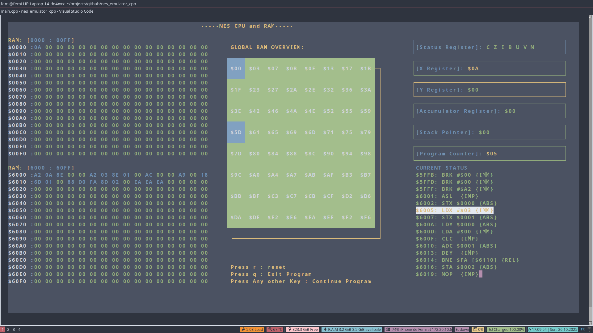
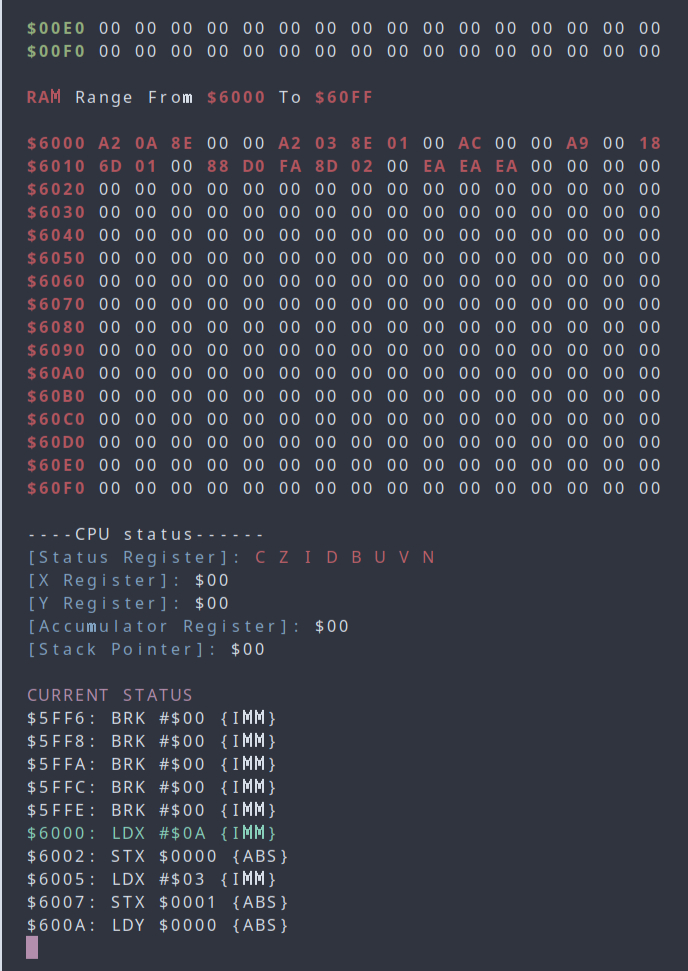
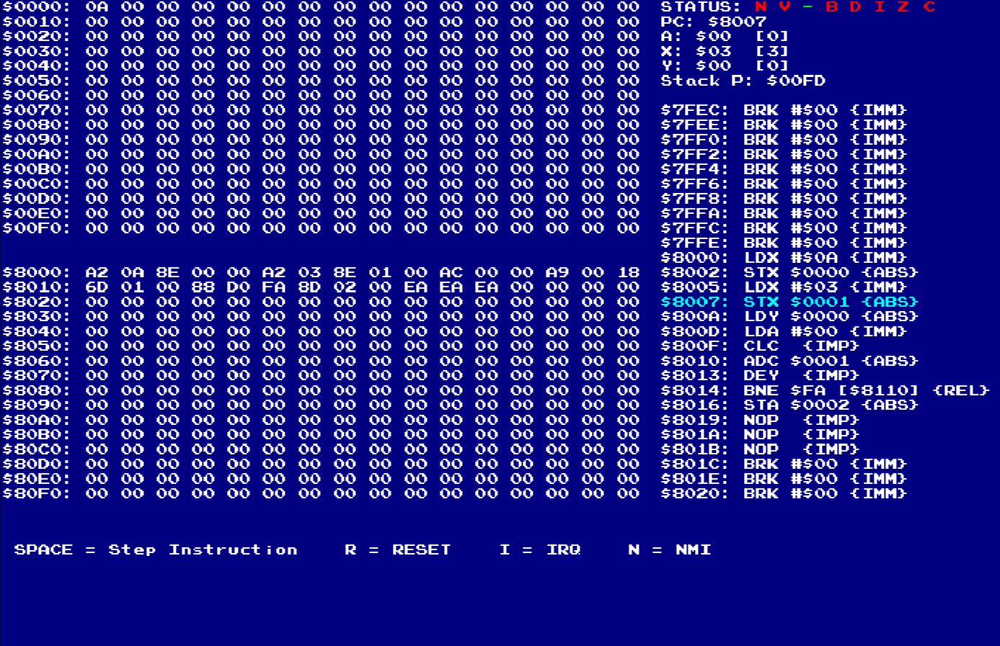

# nes_emulator_cpp

A nes emulator in C++

# Table of Content

* [Overview](#overview)
* [Features](#features)
    * [Visualisation Tools](#visualization-tools)
        * [RAM and CPU](#ram-and-cpu)
* [Architecture](#architecture)
* [Getting Started](#getting-started)
    * [Prerequisites](#prerequisites)
    * [Compilation](#how-to-compile-and-run-)
* [Contribution](#contribution)
* [Acknowledgements](#acknowledgements)

# Overview
This project implements the core of a MOS 6502-based system:

* A CPU class supporting a wide set of opcodes and addressing modes.
* A RAM module emulating the 16-bit address space (0x0000-0xFFFF).
* A simple bus mechanism to connect CPU ↔ RAM (and in the future other devices/peripherals).

The goal is to build a foundation for retro consoles (such as the Nintendo Entertainment System) or for educational/emulation purposes.

# Features

* Implementation of **CPU registers** **(A, X, Y, SP, PC, Status)**
* Fetch-decode-execute cycle emulation
* Memory read/write abstraction via a Bus class
* Support for key 6502 addressing modes (Immediate, Zero Page, Absolute, Indirect, etc.)
* Unit-testable core architecture
* **Visualization Tools** for **Ram** and **CPU** components in **ncurses**,**X11**, and **console mode**

## Visualization Tools

Some Viz tools has been implemented to observe the functioning of some components

### RAM and CPU

You can observe the steps of functioning for the RAM and the CPU with a **program loaded**.
There are 03 view modes:
* NCURSES 

* Console Mode

* X11 (Implemented by [OneLoneCoder](https://github.com/OneLoneCoder))

You can find how to compile and use them further in the documentation

# Architecture

This is how component interact

The CPU uses the BUS interface to read or write to memory addresses.

The RAM class handles the memory array behind the scenes.

In future, the BUS may route reads/writes to ROM, PPU registers, controllers, etc.

# Getting Started

This project is only available on **Linux distros** and **MacOS**

## Prerequisites

* GCC (C++17 Compaitble)
* Make
* X11 *Optionnal, juste for CPU Visualization*
* Ncurses *Optionnal, juste for CPU Visualization*

## How to compile and run ?

### NES Binary

Go at the root of the directory and type:

    make re

It will compile the nes emulator exec

### CPU X11 Visualizer

Go at the root of the directory and type:

    make viz_cpu_ram_x11

It will compile the visualisation binary

To exec it, at the root of the directory type:

    ./cpu_and_ram_x11_visualizer

### CPU Ncurses Visualizer

Go at the root of the directory and type:

    make viz_cpu_ram_ncurses

It will compile the visualisation binary

To exec it, at the root of the directory type:

    ./cpu_and_ram_ncurses_visualizer

### CPU Console Mode Visualizer

Go at the root of the directory and type:

    make viz_cpu_ram_con

It will compile the visualisation binary

To exec it, at the root of the directory type:

    ./cpu_and_ram_console_mode_visualize

# Contribution

Contributions are welcome!
Please follow these guidelines:

* Fork the repository and create a feature branch.
* Write clear, well-documented code and tests.
* Ensure you update documentation if you modify or add behaviour.
* Submit a pull request with a description of your changes and why they help.

# Acknowledgements

[OneLoneCoder](https://github.com/OneLoneCoder) for the olc6502 inspiration

The NESDev community for technical references