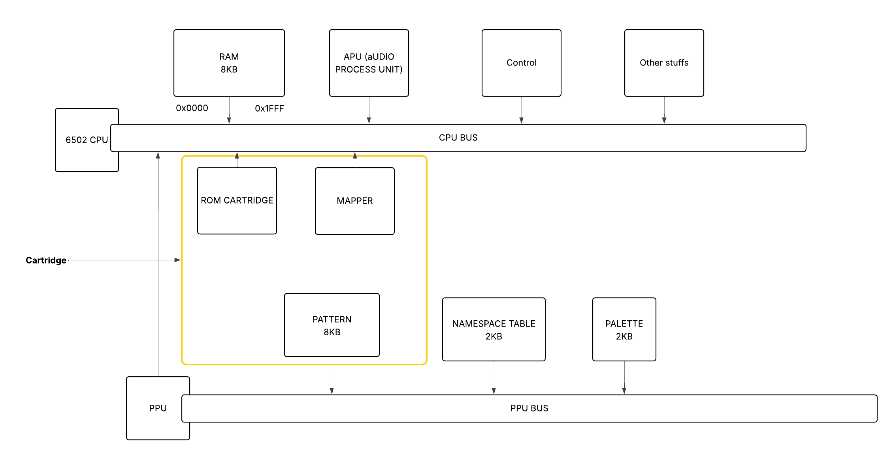

# A correction on the NES Arch

## Ram Addressable range and Mirrorring

The Ram in fact has only **2KB** of memory with a range starting from **0x0000** to **0x1FFF**.  But **0x1FFF** is **8191** so you could say that there is **4X** more space
left BUT there is the special trick: **mirrorring** 

**Mirrorring** is a principle that duplicate **2KB** of memory available on three other semgents. Ranges of the memory are reapting. If I modify The 1Kb of memory, it modify the 3Kb, the 5KB and the 7th KB of memory. To be more precise, the first 2KB of RAM is mapped on the hardware. Each 2KB segments of the RAM is mapped on this original segment linked to the Hardware

So, modifying box 455 is the same as modifying box 2455 and 4455 and 6455. Same for reading from. This will be handled by a bitwise logic and (modulo)

## PPU

Picture process Unit. It has its own bus. Attached to this bus, there is a **8KB addressable range** that reflects the **ppattern memory**. It stores what the graphics will look like (sprite etc ..). Like the **CPU** has it **RAM** going from **0x0000** to **0x1FFF**, the **PPU** has its **Pattern memory** also going from **0x0000** to **1xFFFF**

There is an **additional** dedicated **RAM** from **0x2000** to **0x2FFF**: **The nametable**. It is a 2 dimensional array that stores the IDs of which pattern to show in the background.

The PPU has a small RAM attached on it, **The PALETTES** that describe which **color** should be displayed on the screen, when you combine the **sprites** and the **background**. It start from **0x3000** to **0x3FFF**

The PPU does not has the same addressable range addresse than the CPU. Its is much lower.

The PPU contain the graphical informations while the cpu the logical calculs.

Here we will implement the PPU **2C02** created by **Ricoh**

## The program ROM (cartridge)

The program is store on the cartridge. The Program ROM is adressed via the CPU BUS and is adress range is from **0x4020** to **0xFFFF**, the entire second half range of the CPU Bus. The cartridge, does not simply contain the **program**, it also contain all the graphical informations required to render the game. So, the **Pattern table** is aso stocked on the cartridge. Here on our implementation, we will assume for simplicity that the **Nametable** is stocked on the **NES** itself. Technically some of the name table object can be stored in the cartridge

## Mappers

Sometimes the ammount of program data required, exceeds the adressable range of the CPU, so come the **Mapper** system. It allow different bands of the ROM to be connected to the CPU BUS. So when this ranges are requested, they are throught the same range of the program ROM. The **Mapper** can be **written** or **read** while the ROM can only be **read**

Here is how those components are linked

